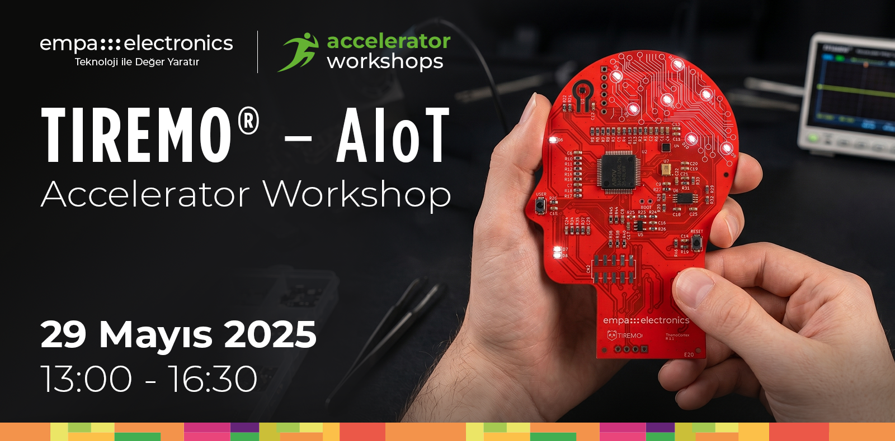

<p align="center">
    
</p>


## Tiremo® Accelerator Workshops'a Hoş Geldiniz!

**Merhaba!**  
Empa Electronics tarafından düzenlenen Tiremo® Accelerator Workshops etkinlikleri serimize hoş geldiniz. Bu açık kaynaklı repository, workshop etkinliğimizde kullanabileceğiniz tüm gereksinimleri edinebilmeniz ve aktivitelere kolaylıkla eşlik edebilmeniz için sizinle paylaşılmıştır.

**Sensörler & Connectivity**  
Sensörler, fiziksel olayları algılayarak elektronik sinyallere (yani verilere) dönüştüren cihazlardır. Bu veriler, analiz edilmek üzere uç birimlere veya bulut sistemlerine bağlantı protokolleriyle iletilir. MQTT gibi hafif yapılı protokoller, sensörlerden gelen verilerin düşük bant genişliğiyle hızlı ve güvenilir bir şekilde aktarılmasını sağlar. Bulut IoT platformları (örneğin, AWS IoT, Azure IoT Hub), bu verilerin merkezi bir yapıda işlenmesine, depolanmasına ve görselleştirilmesine olanak tanır. Uç sistemlerde doğru sensör seçimi ve etkili bağlantı çözümleri, düşük gecikme ve enerji verimliliğiyle optimize edilmiş IoT uygulamaları geliştirilmesinde kilit rol oynamaktadır.

**Uçta Yapay Zeka**  
Bir uygulama için geliştirilen yapay zeka çözümlerinin işletilmesi modern sistemlerde iki farklı türde yapılabilmektedir. Bunlardan birincisi olan bulutta yapay zeka, bir yapay zeka modelinin bulut sunucu üzerinde tesisi (örneğin: AWS/Azure gibi platformlar) ve bu yapay zeka modeline gönderilen veri örnekleri için modelden alınan tahminlerin tekrar göndericiye iletilmesi usulüyle çalışmaktadır. Bir diğer alternatif olan uçta yapay zeka, bir modelin doğrudan çözüm için kullanılan bir uç birimde (_edge_, örneğin: sensör kartı) işletilmesi ve girdi veriler için elde edilen tahminlerin doğrudan aynı platform üzerinde elde edilebilmesidir. Uçta yapay zeka çözümleri, verinin tahminleme için başka bir platforma gönderilmemesi sebebiyle başta düşük gecikme, düşük bant genişliği, düşük güç tüketimi ve veri gizliliği olmak üzere pek çok getiri sağlamaktadır.

## Geliştirme Ortamı Kurulumu
Aktivitelere başlamadan önce aşağıdaki ortak kurulum kılavuzunu takip ederek geliştirme ortamınızı hazırlayınız. Bu kılavuz her iki aktivite için geçerlidir ve yalnızca bir kez uygulanması yeterlidir.

### ↳ [Geliştirme Ortamı Kurulumu](Kurulum.md)
Etkiliğinde kullanılacak çalışma ortamlarının kurulum adımlarını içerir.

---

## Çalıştay Aktiviteleri
Tiremo® Accelerator Workshops etkinliğimizde kullanıcıların katılımıyla interaktif olarak Tiremo®Cortex kullanılarak gerçekleştirilecek aktiviteler için gerekli çalışma ortamları ve kurulum adımları ilgili başlıkta verilmiştir. Geliştirme ortamı kurulumunu tamamladıktan sonra aşağıdaki aktivitelere geçiniz.

### ↳ [1) Tiremo®Cortex ile Veri Toplama ve MQTT Haberleşmesi](Activity1_Sensor_Connectivity_and_MQTT)
Tiremo®Cortex kullanılarak oluşturulan veri akışının MQTT protokolü ile bulutta işlenebilmesini konu alan aktivite için gerekli geliştirme adımlarını içerir. 

### ↳ [2) Tiremo®Cortex ile Uçta Yapay Zeka Çözümleri Geliştirme](Activity2_EdgeAI_Solutions_and_Deployment)
Tiremo®Cortex kullanılarak oluşturulan veri akışının, uçta yapay zeka çözümleri geliştirmeyi konu alan aktivite için gerekli geliştirme adımlarını içerir.

## Dizin Yapısı

Repository içerisindeki her bir "Activity" klasörü, etkinliğimizde yer alacak uygulamalara ait çalışma ortamlarını ve gerekli kurulumları içermektedir. Ek materyal olarak verilen "Demo" klasörleri çalıştay sonrası deneyimleme içindir.

```
Workshop Repository
├── Kurulum.md                                  ← Ortak geliştirme ortamı kurulum kılavuzu
├── Activity1_Sensor_Connectivity_and_MQTT/
│   ├── Project_MQTT/
│   │   └── MQTT_Project/                       ← STM32U5 MCU firmware projesi
│   │       ├── Core/Src/                       ← Uygulama kaynak kodu
│   │       ├── Drivers/STM32U5xx_HAL_Driver/   ← HAL sürücüleri
│   │       └── .project                        ← Proje dosyası
│   └── Aktivite-1 Kılavuzu (README.md)
│
└── Activity2_EdgeAI_Solutions_and_Deployment/
    ├── Kaynak Kod & Materyaller
    └── Aktivite-2 Kılavuzu (README.md)
```

## Ön Gereksinimler
Etkinliğimizde kullanılacak çalışma ortamlarının kurulumları sonrası hazırladığımız checklist ile gereksinimlerin kontrolünü sağlayabilirsiniz.

**Aktivite-1 Tiremo®Cortex ile Veri Toplama ve MQTT Haberleşmesi**
- [ ] [Kurulum.md](Kurulum.md) kılavuzu tamamlandı.
- [ ] `Activity1_Sensor_Connectivity_and_MQTT/Project_MQTT/MQTT_Project/` projesi STM32CubeIDE'de açıldı ve başarıyla derlendi.
- [ ] Aktivite-1 Kaynak Dosyaları.

**Aktivite-2 Tiremo®Intelligence ile Uçta Yapay Zeka Çözümleri Geliştirme**
- [ ] [Kurulum.md](Kurulum.md) kılavuzu tamamlandı (MCU'ya model yüklemek için gereklidir)
- [ ] `Activity2_EdgeAI_Solutions_and_Deployment/Project_DataLogger/` projesi STM32CubeIDE'de açıldı ve başarıyla derlendi
- [ ] Aktivite-2 Kaynak Dosyaları (Tiremo®Intelligence)

## Güncellemeler
Workshop etkinliğimizde gerekli çalışma ortamları üzerindeki güncellemeleri bu başlık altında takip edebilirsiniz.
```
Versiyon-1: 24 Nisan 2026  
Tüm aktiviteler için temel bileşenleri içeren kılavuzlar repository içerisinde paylaşıldı.
```

## Uyarılar

Aktivite çalışma ortamlarının kurulumlarıyla ilgili soru ve taleplerinizi **ai@empa.com** adresine iletebilirsiniz.

Workshop aktiviteleri için sağlanan çalışma ortamlarının son hallerini edinmek için "Güncellemeler" başlığını kontrol ediniz. Kurulumlarını bitirmiş olduğunuz çalışma ortamınıza mevcut güncellemeleri eklemek için terminalinizde repo klasörüne gidiniz ve "git pull" komutu ile güncellemeleri ekleyiniz:
```
cd Tiremo-Accelerator-Workshops-AIoT
git pull origin master
```
